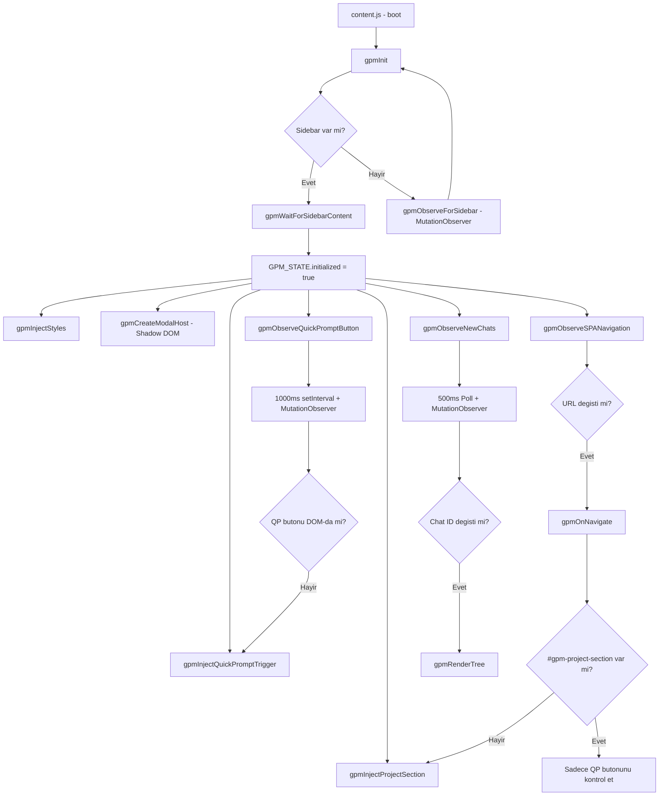

# Shadow DOM Injection & UI Persistence — Mimari Analiz Raporu

> **Tarih:** 2026-03-12  
> **Kapsam:** DOM injection dayanıklılığı, selector stratejisi, MutationObserver mimarisi  
> **Analiz Edilen Dosyalar:** `selectors.js`, `config.js`, `dom-injection.js`, `content.js`, `navigation.js`, `project-tree.js`, `quick-prompts.js`, `ui_elements.js`

---

## 1. Mevcut Mimari — Ne Durumda?

### 1.1 Genel Değerlendirme: ⚠️ Orta-İyi Seviye

Proje zaten birçok iyi pratiği uyguluyor. Ancak bazı kritik kırılganlık noktaları var.

### 1.2 Mevcut Güçlü Yanlar ✅

| Alan | Uygulama | Dosya |
|------|----------|-------|
| **Merkezi Selector Yönetimi** | Tüm CSS selector'lar `GPM_SELECTORS` objesinde toplanmış | `selectors.js` |
| **Fallback Selector Zincirleri** | Sidebar selector'da 6 farklı fallback var | `selectors.js:15` |
| **Shadow DOM İzolasyonu** | Modal/overlay'ler Shadow DOM içinde render ediliyor | `dom-injection.js:317-336` |
| **DocumentFragment Batch Update** | Ağaç render'ı fragment ile yapılıp tek seferde DOM'a ekleniyor | `project-tree.js:88,304-305` |
| **SPA Navigation Hook** | `history.pushState/replaceState` monkey-patch + popstate dinleniyor | `navigation.js:90-101` |
| **Cross-tab Sync** | `chrome.runtime.onMessage` ile sekmeler arası senkronizasyon | `content.js:66-76` |
| **Visibility-based Polling** | Arka plan sekmelerinde polling durduruluyor | `navigation.js:183-191` |
| **AbortController ile Listener Temizliği** | Native chat item listener'ları düzgün temizleniyor | `navigation.js:228-233` |
| **GPM Mutation Filtreleme** | Kendi DOM değişikliklerinden kaynaklanan observer tetiklenmesi engelleniyor | `navigation.js:204-212` |
| **Extension Context Kontrolü** | `gpmIsContextValid()` ile invalidated context hataları yakalanıyor | `config.js:57-63` |
| **6 Aşamalı Insertion Point Stratejisi** | Sidebar'a enjeksiyon için 6 farklı strateji | `dom-injection.js:352-437` |
| **Metin Tabanlı Sidebar Tespiti** | 15 dilde "Chats" etiketleri ile content detection | `dom-injection.js:502-515` |

---

## 2. Risk Analizi — Kırılganlık Noktaları 🔴🟡

### 🔴 YÜKSEK RİSK

#### R1: Quick Prompt Butonu — Hardcoded CSS Class Bağımlılığı
**Dosya:** `quick-prompts.js:39`, `selectors.js:34-36`

```
Kırılgan Selector'lar:
  - '.leading-actions-wrapper'     ← Google istediği zaman class adını değiştirebilir
  - 'toolbox-drawer'               ← Custom element adı, nispeten stabil ama garanti yok
  - '.toolbox-drawer-button-container' ← Çok spesifik, değişme riski yüksek
```

**Sorun:** Quick Prompt ⚡ butonu doğrudan Gemini'ın toolbar'ına `insertBefore/appendChild` ile enjekte ediliyor. Google bu class isimlerini değiştirirse buton hiç görünmez.

**Mevcut Savunma:** `gpmObserveQuickPromptButton()` her 1 saniyede bir butonun varlığını kontrol ediyor + MutationObserver ile izliyor. AMA selector'lar hardcoded — class ismi değişirse hem `setInterval` hem observer bulamaz.

---

#### R2: Input Area Selector — contenteditable Bağımlılığı
**Dosya:** `selectors.js:27`

```
inputArea: '[contenteditable="true"], textarea[aria-label], .ql-editor, [role="textbox"]'
```

**Sorun:** `gpmInsertPromptText()` bu selector ile input alanını buluyor. Gemini'ın input yapısını değiştirmesi durumunda prompt ekleme tamamen kırılır. Ayrıca `contenteditable` bir `<p>` veya `<div>` ise `textContent = text` yaklaşımı Gemini'ın reactive framework'ünü tetiklemeyebilir.

---

#### R3: Sidebar Container — Tek Seferlik Başlatma
**Dosya:** `content.js:49`

```javascript
GPM_STATE.initialized = true;  // Bir kez true olursa bir daha gpmInit() çağrılmaz
```

**Sorun:** Gemini sayfayı tamamen yeniden render ederse (SPA route değişikliği, React/Lit re-mount), sidebar DOM'dan silinir ama `GPM_STATE.initialized = true` kalır. `gpmOnNavigate()` sadece `#gpm-project-section` yoksa yeniden enjekte eder ama timing race condition'a açık.

---

### 🟡 ORTA RİSK

#### R4: Chat URL Format Bağımlılığı
**Dosya:** `config.js:74`, `selectors.js:19`

```
/app/<chatId>  — Mevcut format
/chat/<id>     — Legacy fallback
/c/<id>        — Legacy fallback
```

**Sorun:** Google URL format'ını değiştirirse (örn. `/g/<id>`, `/conversation/<id>`) tüm chat tespiti kırılır. Ancak legacy fallback'ler zaten var, bu pattern extensible.

---

#### R5: Metin Tabanlı Sidebar Content Detection
**Dosya:** `dom-injection.js:502-515`

```javascript
const chatLabels = ['Chats', 'Sohbetler', 'Cuộc trò chuyện', 'Obrolan', ...];
```

**Sorun:** Gemini UI'da "Chats" yerine başka metin kullanılırsa (örn. "Conversations", "History") tespit başarısız olur. Her dil için doğru sidebar etiketinin bilinmesi gerekiyor.

---

#### R6: Chat Item Enhancement — querySelectorAll Flooding
**Dosya:** `navigation.js:236-238`

```javascript
document.querySelectorAll('[data-gpm-enhanced]').forEach(el => {
  if (!el.closest('[data-gpm]')) delete el.dataset.gpmEnhanced;
});
```

**Sorun:** Her MutationObserver tetiklenmesinde TÜM enhanced element'ler temizlenip yeniden işleniyor. Büyük chat listelerinde performans sorunu oluşabilir.

---

## 3. Mimari Akış Diyagramı — Mevcut Durum



---

## 4. Öneriler — İyileştirme Planı

### Öneri 1: Adaptive Selector Engine — YÜKSEK ÖNCELİK 🔴

**Problem:** Hardcoded class isimleri değişirse eklenti kırılır.

**Çözüm:** Selector'ları runtime'da keşfeden akıllı bir fallback mekanizması:

```
Strateji:
1. Önce bilinen selector'ları dene - GPM_SELECTORS
2. Bulamazsan heuristik arama yap:
   - Toolbar: input alanının en yakın üst container'ını bul
   - Sidebar: nav veya role=navigation olan ilk elementi bul  
   - Chat items: /app/ ile başlayan href'leri olan a etiketlerini bul
3. Bulunan selector'ı cache'le ve sonraki aramalarda kullan
4. Cache'lenmiş selector başarısız olursa yeniden keşfet
```

**Etki:** Google CSS class değiştirdiğinde eklenti otomatik adapte olur.

---

### Öneri 2: Self-Healing DOM Observer — YÜKSEK ÖNCELİK 🔴

**Problem:** `GPM_STATE.initialized = true` bir kez set edilince, Gemini sayfayı re-mount ederse eklenti yeniden başlamaz.

**Çözüm:**

```
Strateji:
1. Container'in DOM'da olup olmadigini periyodik kontrol et
2. Container kaybolursa initialized = false yap ve gpmInit tekrar cagir
3. Sidebar'in parent'ina MutationObserver koy - child removal dinle
4. Debounce ile gereksiz re-init'leri engelle
```

**Mevcut `gpmOnNavigate()` bunu kısmen yapıyor ama sadece `#gpm-project-section` kontrolü var — sidebar'ın kendisinin silinmesi durumu ele alınmıyor.**

---

### Öneri 3: Prompt Text Insertion Robustness — ORTA ÖNCELİK 🟡

**Problem:** `gpmInsertPromptText()` Gemini'ın reactive framework'ü ile uyumsuz olabilir.

**Çözüm:**

```
Strateji:
1. execCommand ile clipboard-style insertion dene - deprecated ama calisiyor
2. InputEvent ile insertText simule et
3. Fallback: ClipboardEvent ile paste simule et
4. Son care: focus + dispatchEvent + requestAnimationFrame zinciri
```

---

### Öneri 4: Structural Fingerprinting — ORTA ÖNCELİK 🟡

**Problem:** Class isimleri değişse bile DOM yapısı genelde korunuyor.

**Çözüm:**

```
Strateji:
1. Toolbar'i class adina gore degil, yapiya gore bul:
   - Input alani iceren form'un ust container'i
   - Icerisinde button/icon olan yatay flex container
2. Sidebar'i:
   - a href=/app/ iceren en yakin ust scroll container
3. Chat items'i:
   - Sidebar icindeki tum a[href^=/app/] zaten kullaniliyor - bu iyi
```

---

### Öneri 5: Quick Prompt Buton Enjeksiyonunu Daha Resilient Yapma — YÜKSEK 🔴

**Problem:** `.leading-actions-wrapper` class ismi değişirse buton hiç enjekte edilemez.

**Çözüm:**

```
Strateji:
1. Input area'yi bul - en stabil referans noktasi
2. Input'un parent container'ini bul
3. Container icerisinde buton grubu olan elementi bul - children.length > 1
4. Buton grubuna ekle
5. Hicbir sey bulamazsan floating button olarak goster - position fixed
```

---

### Öneri 6: DOM Health Monitor — DÜŞÜK ÖNCELİK 🟢

**Çözüm:**

```
Strateji:
1. Her 5 saniyede bir kritik elementlerin varligini kontrol et:
   - GPM container sidebar'da mi?
   - Modal host body'de mi?
   - QP butonu DOM'da mi?
2. Eksik olan komponenti sessizce yeniden olustur
3. 3 ardisik basarisizlikta tum sistemi reinitialize et
```

**Bu pattern `gpmObserveQuickPromptButton()` ile QP butonu için zaten var — diğer komponentlere genişletilmeli.**

---

## 5. Öncelik Sıralaması

| # | Öneri | Risk Seviyesi | Karmaşıklık | Etki |
|---|-------|--------------|-------------|------|
| 1 | Self-Healing DOM Observer | 🔴 Yüksek | Orta | Sayfa re-mount'larda eklenti ölmez |
| 2 | QP Buton Enjeksiyonu Resilience | 🔴 Yüksek | Düşük | En sık kırılacak nokta korunur |
| 3 | Adaptive Selector Engine | 🔴 Yüksek | Yüksek | Tüm selector'lar otomatik adapte olur |
| 4 | Prompt Text Insertion | 🟡 Orta | Düşük | Kullanıcı deneyimi korunur |
| 5 | Structural Fingerprinting | 🟡 Orta | Orta | Class degisikliklerine karsi kök çözüm |
| 6 | DOM Health Monitor | 🟢 Düşük | Düşük | Genel stabilite artar |

---

## 6. Sonuç

**Mevcut mimari iyi tasarlanmış** — merkezi selector yönetimi, Shadow DOM izolasyonu, SPA navigation hook'ları, visibility-based polling ve AbortController kullanımı gibi birçok doğru karar alınmış. Ancak 3 kritik kırılganlık noktası var:

1. **Quick Prompt butonu** hardcoded CSS class'lara bağımlı — en kırılgan nokta
2. **`initialized` flag'i** tek yönlü — Gemini re-mount'ları yakalayamıyor  
3. **Input area text insertion** yalnızca basit `textContent` + `InputEvent` kullanıyor

Bu 3 nokta düzeltilirse, eklenti Gemini UI güncellemelerine karşı önemli ölçüde dayanıklı hale gelir. Önerilen iyileştirmelerin çoğu mevcut kodun doğal uzantıları olup, büyük bir refaktöring gerektirmez.
