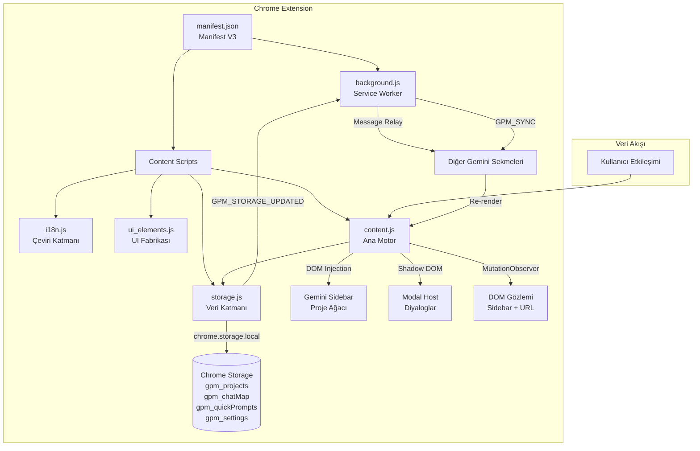

# Gemini Project Manager Pro — Kapsamlı Teknik Değerlendirme Raporu

**Tarih:** 2026-03-12  
**Versiyon:** 1.1.0  
**Proje Türü:** Chrome Extension (Manifest V3)  
**Analiz Kapsamı:** Tüm kaynak kodları, mimari yapı, güvenlik, performans, UX, test kapsamı

---

## İçindekiler

1. [Genel Özet](#1-genel-özet)
2. [Mimari Tasarım Analizi](#2-mimari-tasarım-analizi)
3. [Kod Kalitesi ve Okunabilirlik](#3-kod-kalitesi-ve-okunabilirlik)
4. [Tespit Edilen Buglar ve Hatalar](#4-tespit-edilen-buglar-ve-hatalar)
5. [Eksik veya Tamamlanmamış Özellikler](#5-eksik-veya-tamamlanmamış-özellikler)
6. [Güvenlik Açıkları ve Riskleri](#6-güvenlik-açıkları-ve-riskleri)
7. [Performans Darboğazları](#7-performans-darboğazları)
8. [Kullanıcı Deneyimi İyileştirme Alanları](#8-kullanıcı-deneyimi-iyileştirme-alanları)
9. [Kod Tekrarı ve Refactoring Gerektiren Bölümler](#9-kod-tekrarı-ve-refactoring-gerektiren-bölümler)
10. [Test Eksiklikleri](#10-test-eksiklikleri)
11. [Bağımlılık Yönetimi](#11-bağımlılık-yönetimi)
12. [Ölçeklenebilirlik Değerlendirmesi](#12-ölçeklenebilirlik-değerlendirmesi)
13. [Önceliklendirilmiş İyileştirme Önerileri](#13-önceliklendirilmiş-iyileştirme-önerileri)
14. [Kısa Vadeli ve Uzun Vadeli Eylem Planı](#14-kısa-vadeli-ve-uzun-vadeli-eylem-planı)

---

## 1. Genel Özet

**Gemini Project Manager Pro**, Google Gemini AI arayüzünün sidebar'ına proje yönetimi, klasör organizasyonu ve hızlı prompt şablonları ekleyen bir Chrome uzantısıdır.

### Proje Yapısı

```
gemini-project-manager-pro/
├── manifest.json              # Manifest V3 yapılandırması
├── _locales/                  # 10 dil desteği (Chrome i18n API)
│   ├── en/, tr/, de/, fr/, es/, it/, pt/, ru/, ja/, zh_CN/
├── icons/                     # Uzantı ikonları (16, 48, 128px)
├── src/
│   ├── background.js          # Service Worker (~33 satır)
│   ├── content.js             # Ana motor — DOM enjeksiyonu (~1508 satır)
│   ├── i18n.js                # Uygulama içi çeviri katmanı (~811 satır)
│   ├── storage.js             # Veri katmanı — Chrome Storage API (~293 satır)
│   ├── ui_elements.js         # UI bileşen fabrikası (~827 satır)
│   └── styles.css             # Shadow DOM modal stilleri (~787 satır)
├── README.md, LICENSE, .gitignore
```

### Kullanılan Teknolojiler

| Katman | Teknoloji |
|--------|-----------|
| Platform | Chrome Extension Manifest V3 |
| Dil | Vanilla JavaScript (ES2020+) |
| Depolama | Chrome Storage Local API |
| UI Yaklaşımı | Direct DOM Injection + Shadow DOM (modaller) |
| Stil | Scoped CSS (data-gpm attributeleri) + Shadow DOM CSS |
| i18n | Dual system: Chrome `_locales` + uygulama içi `GPM_STRINGS` |
| Mimari Desen | IIFE Modül Pattern, Observer Pattern |

### Temel Özellikler

- ✅ Proje ve alt klasör oluşturma (özel ikon ve renk)
- ✅ Drag & drop sohbet organizasyonu
- ✅ Hızlı prompt şablonları (arama, düzenleme, yedekleme)
- ✅ 10 dil desteği
- ✅ Gemini UI'a native entegrasyon (dark/light mode)
- ✅ JSON dışa/içe aktarım
- ✅ Otomatik yedekleme ve geri yükleme
- ✅ Mutex tabanlı yazma koruması (çoklu sekme güvenliği)
- ✅ Cross-tab senkronizasyon (debounced)

---

## 2. Mimari Tasarım Analizi

### 2.1 Güçlü Yönler

#### ✅ Shadow DOM İzolasyonu (Modaller)
Modal ve overlay bileşenleri Shadow DOM içinde render edilerek Gemini'nin kendi stillerinden izole edilmiş. Bu, stil çakışmalarını önleyen profesyonel bir yaklaşım.

```
gpmModalHost (Shadow DOM) → modaller, context menüler, quick prompts paneli
gpmContainer (Direct DOM) → sidebar proje ağacı (native görünüm için)
```

#### ✅ Savunmacı DOM Enjeksiyon Stratejisi
[`gpmFindInsertionPoint()`](src/content.js:372) fonksiyonu 6 farklı strateji kullanarak sidebar'da doğru ekleme noktasını buluyor. Gemini'nin DOM yapısı değişse bile uzantının çalışma ihtimalini artırıyor.

#### ✅ SPA Navigasyon Gözlemi
[`gpmObserveSPANavigation()`](src/content.js:1081) fonksiyonu `history.pushState` ve `history.replaceState` fonksiyonlarını monkey-patch ederek SPA navigasyonunu yakalıyor — tek sayfa uygulamalar için doğru bir yaklaşım.

#### ✅ Mutex Tabanlı Yazma Koruması
[`_withLock()`](src/storage.js:24) ile seri hale getirilmiş yazma işlemleri, çoklu sekme senaryolarında veri bozulmasını önlüyor.

#### ✅ Otomatik Yedekleme Mekanizması
Her [`saveProjects()`](src/storage.js:45) ve [`saveChatMap()`](src/storage.js:127) çağrısında mevcut veri otomatik olarak yedekleniyor.

### 2.2 Zayıf Yönler

#### ❌ Monolitik content.js (1508 satır)
[`content.js`](src/content.js) dosyası hem DOM manipülasyonu, hem iş mantığı, hem olay yönetimi, hem navigasyon kontrolü barındırıyor. Single Responsibility prensibi ihlal ediliyor.

**Etki:** Yüksek — bakım zorluğu, hata ayıklama güçlüğü  
**Öneri:** Content script'i şu modüllere ayırın:
- `dom-injection.js` — Sidebar enjeksiyonu ve insertion point bulma
- `project-tree.js` — Proje ağacı render ve etkileşim
- `drag-drop.js` — Sürükle-bırak mantığı
- `quick-prompts.js` — Hızlı prompt paneli
- `navigation.js` — SPA navigasyon ve chat observer

#### ❌ İkili i18n Sistemi (Gereksiz Tekrar)
Hem Chrome'un native `_locales/` sistemi hem de [`GPM_STRINGS`](src/i18n.js:7) ile uygulama içi çeviri kullanılıyor. `_locales/` sadece `extensionName` ve `extensionDescription` için kullanılırken, tüm UI çevirileri `GPM_STRINGS`'de.

**Etki:** Orta — bakım maliyeti artışı, senkronizasyon riski  
**Öneri:** Ya tamamen `_locales/` + `chrome.i18n.getMessage()` kullanın ya da `_locales/`'i sadece manifest için minimal tutun.

#### ❌ Gemini DOM Yapısına Sıkı Bağımlılık
[`GPM_SELECTORS`](src/content.js:13) objesindeki CSS selector'lar Gemini'nin sınıf adlarına (`conversations-list`, `.chat-history`, `.gems-list-container`, `.leading-actions-wrapper`, `toolbox-drawer`) doğrudan bağımlı. Gemini UI güncellemelerinde kırılma riski çok yüksek.

**Etki:** Kritik — Gemini güncellemesinde uzantı çalışmaz hale gelebilir  
**Öneri:** 
- Selector'ları merkezi bir config dosyasında tutun
- Fallback selector zincirleri ekleyin (zaten kısmen yapılmış)
- Selector başarısızlıklarını kullanıcıya bildiren bir mekanizma ekleyin

#### ❌ State Yönetimi Eksikliği
Global değişkenlerle (`gpmContainer`, `gpmModalHost`, `gpmInitialized`, `gpmPendingChatAssignment`, vb.) state yönetimi yapılıyor. Merkezi bir state store yok.

**Etki:** Orta — race condition ve tutarsız state riski  
**Öneri:** Basit bir event-driven state manager veya observable pattern implementasyonu

---

## 3. Kod Kalitesi ve Okunabilirlik

### 3.1 Olumlu Bulgular

| Kriter | Değerlendirme |
|--------|---------------|
| Yorum kalitesi | ✅ İyi — ASCII art bölüm ayırıcıları, JSDoc yorum blokları |
| Adlandırma convensionu | ✅ Tutarlı — `gpm` prefix kullanımı, camelCase |
| Fonksiyon boyutu | ⚠️ Karışık — çoğu fonksiyon 20-50 satır, ama [`gpmCreateProjectRow()`](src/content.js:605) 208 satır |
| Kod organizasyonu | ✅ Mantıksal bölümleme iyi (ASCII art header'lar ile) |
| Error handling | ⚠️ Kısmi — try-catch blokları var ama sistematik değil |

### 3.2 Sorunlu Alanlar

#### ⚠️ Aşırı Uzun Fonksiyonlar

| Fonksiyon | Satır Sayısı | Konum |
|-----------|-------------|-------|
| [`gpmCreateProjectRow()`](src/content.js:605) | ~208 | content.js:605-813 |
| [`gpmRenderTree()`](src/content.js:497) | ~102 | content.js:497-599 |
| [`gpmToggleQuickPrompts()`](src/content.js:1340) | ~81 | content.js:1340-1421 |
| [`createProjectModal()`](src/ui_elements.js:71) | ~163 | ui_elements.js:71-234 |

#### ⚠️ Inline Style Kullanımı
[`content.js`](src/content.js) ve [`ui_elements.js`](src/ui_elements.js) dosyalarında yoğun inline style kullanımı var. Özellikle [`ui_elements.js`](src/ui_elements.js) içindeki `el()` çağrılarında onlarca satır inline CSS:

```javascript
// ui_elements.js:84 — Örnek
style: { display: 'flex', alignItems: 'center', justifyContent: 'space-between', marginBottom: '20px' }
```

**Öneri:** Bu stilleri `styles.css`'e taşıyın ve class-based yaklaşıma geçin.

#### ⚠️ Magic Number ve String'ler

```javascript
// content.js:97 — timeout değerleri
setTimeout(() => { observer.disconnect(); resolve(false); }, timeout); // 10000ms
// content.js:1102 — navigasyon gecikmesi
setTimeout(() => { ... }, 600);
// content.js:1149 — polling aralığı  
}, 500);
// content.js:1154 — timeout süresi
if (Date.now() - gpmPendingChatAssignment._ts > 120000) {
```

**Öneri:** Timeout ve aralık değerlerini const olarak tanımlayın:
```javascript
const GPM_CONFIG = {
  SIDEBAR_TIMEOUT: 15000,
  CONTENT_TIMEOUT: 10000,
  NAV_DELAY: 600,
  POLL_INTERVAL: 500,
  ASSIGNMENT_TIMEOUT: 120000,
  SYNC_DEBOUNCE: 300
};
```

---

## 4. Tespit Edilen Buglar ve Hatalar

### 🔴 Kritik Seviye

#### BUG-001: `uid()` Fonksiyonunda Çakışma Riski
**Konum:** [`storage.js:17-19`](src/storage.js:17)
```javascript
function uid() {
  return Date.now().toString(36) + Math.random().toString(36).slice(2, 8);
}
```
**Sorun:** `Date.now()` milisaniye hassasiyetinde. Aynı milisaniye içinde birden fazla çağrı yapılırsa (örn. toplu import) ve `Math.random()` değerleri çakışırsa ID çakışması olabilir.  
**Önerilen Çözüm:** `crypto.getRandomValues()` kullanın veya UUID v4 formatı tercih edin:
```javascript
function uid() {
  return crypto.getRandomValues(new Uint32Array(2)).reduce((s, v) => s + v.toString(36), '') + Date.now().toString(36);
}
```

#### BUG-002: `importAll()` Veri Doğrulama Eksikliği
**Konum:** [`storage.js:239-245`](src/storage.js:239)
```javascript
async function importAll(jsonString) {
  const data = JSON.parse(jsonString);
  if (data.gpm_projects) await _set('gpm_projects', data.gpm_projects);
  // ... doğrudan yazıyor, yapı kontrolü yok
}
```
**Sorun:** Import edilen JSON şema doğrulamasından geçmiyor. Bozuk veya kötü niyetli veri doğrudan storage'a yazılabilir. Mevcut veri yedeklenmeden üzerine yazılıyor.  
**Önerilen Çözüm:** Import öncesi şema doğrulaması ve otomatik yedekleme ekleyin.

#### BUG-003: `deleteQuickPrompt()` Fonksiyonu Storage Modülünde Mevcut Ama Hiçbir Yerden Çağrılmıyor
**Konum:** [`storage.js:209-213`](src/storage.js:209)  
**Sorun:** Kullanıcılar quick prompt silemez — düzenleme var ama silme UI'ı yok.  
**Önerilen Çözüm:** Quick prompt kartlarına silme butonu ekleyin.

### 🟡 Orta Seviye

#### BUG-004: Context Menü Konumlandırma Sorunu
**Konum:** [`ui_elements.js:296-298`](src/ui_elements.js:296)
```javascript
const rect = menu.getBoundingClientRect();
if (rect.right > window.innerWidth) menu.style.left = (x - rect.width) + 'px';
if (rect.bottom > window.innerHeight) menu.style.top = (y - rect.height) + 'px';
```
**Sorun:** Shadow DOM içinde `getBoundingClientRect()` çağrılıyor ama menu `position: fixed` ile modal host'un shadow root'unda. Host'un `width: 0; height: 0` stilinde olması nedeniyle konum hesaplaması yanlış olabilir.  
**Önerilen Çözüm:** Context menüyü host element üzerinden değil, doğrudan viewport koordinatları ile konumlandırın.

#### BUG-005: `gpmEnhanceNativeChatItems()` Memory Leak Riski
**Konum:** [`content.js:1178-1227`](src/content.js:1178)
**Sorun:** `contextmenu` event listener'ı her seferinde `GPMStorage.getProjects()` ve `GPMStorage.getChatMap()` çağrısı yapıyor (async). Ancak eski listener'lar temizlenmiyor — `dataset.gpmEnhanced` kontrolü sadece ilk eklemeyi önlüyor ama DOM node recycle durumunda (Gemini sidebar'daki virtual scrolling) aynı element'e yeni listener eklenebilir.  
**Önerilen Çözüm:** `AbortController` ile event listener yaşam döngüsünü yönetin.

#### BUG-006: Cross-Tab Sync'de `sendResponse` Timing Sorunu
**Konum:** [`background.js:20-33`](src/background.js:20)
```javascript
chrome.runtime.onMessage.addListener((message, sender, sendResponse) => {
  if (message.type === 'GPM_STORAGE_UPDATED') {
    chrome.tabs.query({ url: 'https://gemini.google.com/*' }, (tabs) => {
      tabs.forEach((tab) => {
        if (tab.id !== sender.tab?.id) {
          chrome.tabs.sendMessage(tab.id, { type: 'GPM_SYNC' });
        }
      });
    });
    sendResponse({ ok: true });
  }
  return true;
});
```
**Sorun:** `return true` asenkron yanıt için kullanılıyor ama `sendResponse` senkron olarak çağrılıyor. `chrome.tabs.query` callback'i tamamlanmadan yanıt dönüyor.  
**Önerilen Çözüm:** `sendResponse`'u callback içine taşıyın veya Promise tabanlı yapıya geçin.

### 🟢 Düşük Seviye

#### BUG-007: Renk Seçim Durumu Modal'da Görsel Olarak Gösterilmiyor
**Konum:** [`ui_elements.js:71-234`](src/ui_elements.js:71)
**Sorun:** `createProjectModal`'da renk seçimi CATEGORIES chip'lerine tıklandığında güncelleniyor ama renk swatch grid'i yok — kullanıcı seçilen rengi göremez.  
**Önerilen Çözüm:** Renk palette grid'ini modal'a ekleyin (COLORS dizisi zaten mevcut).

#### BUG-008: `gpmSidebarHasContent()` Hardcoded Türkçe Kontrol
**Konum:** [`content.js:107`](src/content.js:107)
```javascript
if (sidebar.textContent?.includes('Sohbetler')) return true;
```
**Sorun:** Sadece İngilizce ve Türkçe metin kontrolü var. Diğer 8 dildeki sidebar başlıkları kontrol edilmiyor.  
**Önerilen Çözüm:** Tüm desteklenen dillerdeki "Chats" çevirilerini kontrol dizisine ekleyin.

---

## 5. Eksik veya Tamamlanmamış Özellikler

| # | Özellik | Durum | Öncelik |
|---|---------|-------|---------|
| 1 | Quick Prompt silme işlevi | ❌ Storage'da var, UI'da yok | Yüksek |
| 2 | Proje arama/filtreleme | ❌ i18n key'i var (`search`) ama implementasyon yok | Orta |
| 3 | Collapse All / Expand All | ❌ i18n key'leri var ama implementasyon yok | Düşük |
| 4 | Renk palette'i proje oluşturma modal'ında | ❌ COLORS dizisi var ama gösterilmiyor | Orta |
| 5 | Theme ayarı (dark/light/auto) | ⚠️ Settings'de `theme` kaydediliyor ama kullanılmıyor | Düşük |
| 6 | Storage kullanım göstergesi | ❌ i18n key'i var (`storageUsed`) ama implementasyon yok | Düşük |
| 7 | Pinned chats veri yapısı | ⚠️ `gpm_pinnedChats` initialize ediliyor ama hiç kullanılmıyor | Düşük |
| 8 | Popup/Options sayfası | ❌ Yok — tüm etkileşim content script üzerinden | Düşük |
| 9 | Undo/Redo mekanizması | ❌ Yok | Orta |
| 10 | Klavye kısayolları | ❌ Yok | Orta |

---

## 6. Güvenlik Açıkları ve Riskleri

### 🔴 Yüksek Risk

#### SEC-001: innerHTML Kullanımı (XSS Riski)
**Konum:** [`ui_elements.js:56`](src/ui_elements.js:56), [`ui_elements.js:563`](src/ui_elements.js:563)
```javascript
// ui_elements.js:56
else if (key === 'innerHTML') elem.innerHTML = val;

// ui_elements.js:563 — SVG enjeksiyonu
innerHTML: '<svg width="14" height="14" viewBox="0 0 24 24"...'
```
**Sorun:** `el()` yardımcı fonksiyonu `innerHTML` desteği sunuyor. Şu anda sadece hardcoded SVG ile kullanılsa da, gelecekte kullanıcı girdisiyle çağrılırsa XSS açığı oluşur.  
**Risk Seviyesi:** Yüksek (potansiyel), Orta (mevcut kullanımda)  
**Önerilen Çözüm:**
- `innerHTML`'i `el()` fonksiyonundan kaldırın
- SVG'ler için ayrı bir `createSVGIcon()` helper yazın
- DOMPurify gibi bir sanitizer kullanın

#### SEC-002: Import Verisi Doğrulanmıyor
**Konum:** [`storage.js:239-245`](src/storage.js:239), [`content.js:1396-1410`](src/content.js:1396)
**Sorun:** JSON import işlemlerinde (hem genel veri hem quick prompts) gelen veri hiçbir şema doğrulamasından geçmeden doğrudan storage'a yazılıyor.  
**Saldırı Vektörü:** Kötü niyetli JSON dosyası ile XSS payload içeren prompt veya proje adı enjekte edilebilir.  
**Önerilen Çözüm:** JSON Schema validation veya en azından field-level sanitization uygulayın.

### 🟡 Orta Risk

#### SEC-003: `confirm()` ve `alert()` Kullanımı
**Konum:** Birden fazla yer — [`content.js:961`](src/content.js:961), [`content.js:1471`](src/content.js:1471), [`content.js:1477`](src/content.js:1477)
**Sorun:** Native `confirm()` ve `alert()` diyalogları, extension bağlamında phishing için kullanılabilir. Ayrıca Gemini sayfası üzerinde gösterilmesi UX tutarsızlığı yaratır.  
**Önerilen Çözüm:** Custom modal tabanlı onay diyalogları kullanın (zaten Shadow DOM modal altyapınız var).

#### SEC-004: `history.pushState` / `replaceState` Monkey-Patching
**Konum:** [`content.js:1088-1091`](src/content.js:1088)
```javascript
const origPush = history.pushState;
history.pushState = function (...a) { origPush.apply(this, a); check(); };
```
**Sorun:** Global `history` API'sini patch'lemek, diğer uzantılar veya Gemini'nin kendi kodu ile çakışabilir. Orijinal referanslar korunuyor ama çoklu uzantı senaryosunda öngörülemeyen davranışlara neden olabilir.  
**Önerilen Çözüm:** `Navigation API` (Chrome 105+) kullanın veya MutationObserver + URL polling ile daha güvenli navigasyon takibi yapın.

### 🟢 Düşük Risk

#### SEC-005: Console.log ile Hassas Bilgi Sızıntısı
**Konum:** Tüm dosyalarda yaygın — `console.log('[GPM]...')`  
**Sorun:** Production build'de debug logları aktif. Chat ID'leri, proje adları gibi bilgiler konsola yazılıyor.  
**Önerilen Çözüm:** Debug mode flag'i veya build-time log stripping implementasyonu.

---

## 7. Performans Darboğazları

### 🔴 Kritik

#### PERF-001: `setInterval` ile Sürekli Polling
**Konum:** [`content.js:1115-1159`](src/content.js:1115)
```javascript
setInterval(() => {
  const currentUrl = location.href;
  const id = gpmGetCurrentChatId();
  // ... her 500ms'de URL kontrolü
}, 500);

setInterval(() => {
  // ... her 5s'de pending assignment timeout kontrolü
}, 5000);
```

Ve [`content.js:1300-1312`](src/content.js:1300):
```javascript
setInterval(() => {
  // ... her 1s'de Quick Prompt button kontrolü
}, 1000);
```

**Sorun:** 3 ayrı `setInterval` sürekli çalışıyor:
- Her 500ms: URL değişiklik kontrolü
- Her 1s: Quick Prompt button varlık kontrolü  
- Her 5s: Pending assignment timeout kontrolü

**Etki:** Sürekli CPU kullanımı, pil tüketimi (mobil/laptop), background tab'larda bile aktif  
**Önerilen Çözüm:**
- URL kontrolü için `Navigation API` veya `popstate` + `pushState` patch yeterli (zaten var)
- Button kontrolü için `MutationObserver` yeterli (zaten var — duplicate!)
- `requestIdleCallback` veya `requestAnimationFrame` ile optimize edin
- `document.visibilityState` kontrolü ekleyerek arka plan tab'larda polling'i durdurun

#### PERF-002: `gpmRenderTree()` Her Güncellemede Tam Re-render
**Konum:** [`content.js:497-599`](src/content.js:497)
```javascript
async function gpmRenderTree() {
  if (!gpmContainer) return;
  gpmContainer.innerHTML = ''; // ← Tüm DOM yıkılıp yeniden oluşturuluyor
  // ...
}
```
**Sorun:** Her state değişikliğinde (drag-drop, pin/unpin, rename, navigasyon) tüm proje ağacı DOM'dan kaldırılıp yeniden oluşturuluyor. Bu, çok sayıda proje/sohbetle yavaşlamaya neden olur.  
**Önerilen Çözüm:** Virtual DOM diff veya targeted DOM update mekanizması implementasyonu.

### 🟡 Orta

#### PERF-003: Alias Çözümleme Her Render'da
**Konum:** [`content.js:506-522`](src/content.js:506)
**Sorun:** `gpmRenderTree()` her çağrıldığında tüm sidebar linkleri taranıyor ve alias'lar güncelleniyorsa storage'a yazılıyor (bu da `gpmRenderTree()` yi tetikleyebilir).  
**Önerilen Çözüm:** Alias çözümlemeyi ayrı bir debounced fonksiyona alın.

#### PERF-004: MutationObserver Kaskad Etkisi
**Konum:** [`content.js:1168-1173`](src/content.js:1168)
**Sorun:** Sidebar üzerinde `childList: true, subtree: true` ile geniş kapsamlı MutationObserver çalışıyor. Gemini'nin kendi DOM güncellemeleri (mesaj listesi, typing indicator vb.) de bu observer'ı tetikliyor.  
**Önerilen Çözüm:** Observer scope'unu daraltın veya mutation'ları filtreleyin.

---

## 8. Kullanıcı Deneyimi İyileştirme Alanları

### 8.1 Erişilebilirlik (Accessibility) Eksiklikleri

| # | Sorun | Önem |
|---|-------|------|
| 1 | Hiçbir interaktif elementte `aria-label` veya `role` attribute'u yok | 🔴 Yüksek |
| 2 | Klavye navigasyonu desteklenmiyor (Tab, Enter, Escape) | 🔴 Yüksek |
| 3 | Ekran okuyucu desteği yok | 🔴 Yüksek |
| 4 | Focus trap modal'larda implementasyon edilmemiş | 🟡 Orta |
| 5 | Renk kontrastı kontrol edilmemiş (WCAG 2.1 AA) | 🟡 Orta |
| 6 | Drag & drop işlemleri için alternatif (klavye) yoktur | 🟡 Orta |

### 8.2 UI/UX İyileştirme Önerileri

#### UX-001: Hata Mesajları
Şu anda `alert()` ve `confirm()` kullanılıyor. Custom modal tabanlı, lokalize edilmiş hata mesajları gerekli.

#### UX-002: Loading/Empty State'ler
Proje listesi yüklenirken veya boşken görsel geri bildirim yok. Skeleton loading veya anlamlı boş durum görselleri eklenebilir.

#### UX-003: Drag & Drop Görsel Geri Bildirimi
Sürükleme sırasında hedef bölge göstergesi (top/bottom/center) CSS'de tanımlı ama `gpm-drag-top` ve `gpm-drag-bottom` class'ları sadece Shadow DOM stillerinde var — inline styles'da tanımlı değil. Bu, sidebar'daki proje ağacında reorder indicator'ların çalışmaması anlamına gelebilir.

#### UX-004: Onboarding Deneyimi
İlk kullanım rehberi veya tooltip'ler yok. Drag & drop hint mesajı (`dragHint`) tanımlı ama gösterilmiyor.

#### UX-005: Responsive Tasarım
Quick Prompts paneli (`width: 420px`) dar ekranlarda veya sidebar daraltıldığında sorunlu olabilir.

---

## 9. Kod Tekrarı ve Refactoring Gerektiren Bölümler

### 9.1 Yüksek Tekrar Alanları

#### REF-001: Chat ID Çıkarma Mantığı (4 kez tekrarlanıyor)
Chat ID'yi URL'den çıkarma kodu birden fazla yerde tekrarlanıyor:

1. [`gpmGetCurrentChatId()`](src/content.js:1061) — `/app/<id>` pattern
2. [`gpmRenderTree()`](src/content.js:511) — alias çözümleme
3. [`gpmCreateProjectRow() drop handler`](src/content.js:770-789) — chat drop
4. [`gpmEnhanceNativeChatItems()`](src/content.js:1191) — native item enhancement

**Önerilen Çözüm:** Tek bir `extractChatIdFromUrl(urlOrHref)` utility fonksiyonu oluşturun.

#### REF-002: Context Menü Oluşturma (2 ayrı akış)
[`gpmShowProjectContextMenu()`](src/content.js:918) ve [`gpmShowChatContextMenu()`](src/content.js:968) doğrudan `GPMUI.showContextMenu()` çağırıyor — bu iyi. Ancak [`ui_elements.js`](src/ui_elements.js) içindeki [`createTreeNode()`](src/ui_elements.js:319) ve [`createChatItem()`](src/ui_elements.js:450) fonksiyonları da aynı context menü mantığını kendi başlarına oluşturuyor. Bu, iki ayrı rendering path olduğunu gösteriyor:

- **Path 1:** `content.js` — Direct DOM rendering (aktif olarak kullanılan)
- **Path 2:** `ui_elements.js` — `createTreeNode()` / `createChatItem()` (kullanılmıyor gibi görünüyor)

**Sorun:** `ui_elements.js`'deki tree rendering fonksiyonları (`createTreeNode`, `createChatItem`) content.js tarafından hiç çağrılmıyor. Bu dead code.

**Önerilen Çözüm:** Kullanılmayan fonksiyonları temizleyin veya content.js'i bunları kullanacak şekilde refactor edin.

#### REF-003: İnline Style Tekrarı
`ui_elements.js` içinde aynı style pattern'leri onlarca kez tekrarlanıyor:
```javascript
style: { display: 'flex', alignItems: 'center', ... }  // ~15+ kez
style: { background: 'none', border: 'none', ... }       // ~10+ kez
```

**Önerilen Çözüm:** CSS class'ları tanımlayın ve `className` kullanın.

### 9.2 Dead Code

| Konum | Açıklama |
|-------|----------|
| [`ui_elements.js:319-445`](src/ui_elements.js:319) | `createTreeNode()` — hiçbir yerden çağrılmıyor |
| [`ui_elements.js:450-506`](src/ui_elements.js:450) | `createChatItem()` — hiçbir yerden çağrılmıyor |
| [`storage.js:118-120`](src/storage.js:118) | `getChildren()` — hiçbir yerden çağrılmıyor |
| [`background.js:13`](src/background.js:13) | `gpm_pinnedChats` — initialize ediliyor ama kullanılmıyor |

---

## 10. Test Eksiklikleri

### Mevcut Durum: ❌ Hiç Test Yok

Proje herhangi bir test framework'ü veya test dosyası içermiyor. Bu kritik bir eksikliktir.

### Önerilen Test Stratejisi

#### 10.1 Unit Test (Öncelik: Yüksek)
- **Framework:** Jest veya Vitest
- **Hedef:** `storage.js` fonksiyonları (Chrome Storage API mock ile)
  - `createProject()` — doğru yapı oluşturma
  - `assignChat()` / `unassignChat()` — veri tutarlılığı
  - `deleteProject()` — cascade silme, orphan temizliği
  - `importAll()` / `exportAll()` — round-trip integrity
  - `uid()` — uniqueness garantisi
- **Hedef:** `i18n.js` — fallback mekanizması, eksik key handling

#### 10.2 Integration Test (Öncelik: Orta)
- **Framework:** Puppeteer veya Playwright + chrome-extension loading
- **Hedef:**
  - Sidebar enjeksiyonu doğrulama
  - Proje CRUD işlemleri
  - Drag & drop senaryoları
  - Cross-tab sync

#### 10.3 E2E Test (Öncelik: Düşük)
- Gerçek Gemini sayfası üzerinde tam akış testleri
- Visual regression testleri

### Hedef Test Kapsamı

| Modül | Mevcut | Hedef |
|-------|--------|-------|
| storage.js | %0 | %90+ |
| i18n.js | %0 | %80+ |
| ui_elements.js | %0 | %60+ |
| content.js | %0 | %40+ |

---

## 11. Bağımlılık Yönetimi

### Mevcut Durum

Proje **sıfır harici bağımlılığa** sahip — tamamen vanilla JavaScript. Bu hem bir avantaj hem de dezavantaj:

#### ✅ Avantajlar
- Bundle size sıfır (ek yük yok)
- Supply chain attack riski yok
- Chrome Extension review sürecini kolaylaştırır
- Versiyon uyumsuzluğu sorunu yok

#### ❌ Dezavantajlar
- Build sistemi yok (minification, tree-shaking, dead code elimination)
- Linting yok (ESLint, Prettier)
- TypeScript desteği yok (tip güvenliği yok)
- Test framework'ü yok
- Bundler yok (webpack, vite, rollup)

### Önerilen Bağımlılık Eklentileri

| Araç | Amaç | Kritiklik |
|------|-------|-----------|
| ESLint + Prettier | Kod kalitesi ve tutarlılık | Yüksek |
| TypeScript (veya JSDoc types) | Tip güvenliği | Orta |
| Vitest veya Jest | Unit testing | Yüksek |
| web-ext veya crx | Extension build/packaging | Orta |
| DOMPurify | HTML sanitization (güvenlik) | Yüksek |

---

## 12. Ölçeklenebilirlik Değerlendirmesi

### 12.1 Veri Ölçeği

| Senaryo | Mevcut Destek | Potansiyel Sorun |
|---------|---------------|------------------|
| 1-10 proje | ✅ İyi | — |
| 10-50 proje | ⚠️ Yavaşlayabilir | Full re-render her güncellemede |
| 50+ proje | ❌ Sorunlu | DOM node sayısı, storage read/write |
| 1-50 sohbet/proje | ✅ İyi | — |
| 50+ sohbet/proje | ⚠️ Yavaşlayabilir | Tüm chatIds dizisi her render'da taranıyor |
| Chrome Storage limiti | ⚠️ Risk | `storage.local` 10MB sınırı (unlimitedStorage izni yok) |

### 12.2 Mimari Ölçeklenebilirlik

| Kriter | Değerlendirme |
|--------|---------------|
| Modül ekleme kolaylığı | ❌ Zayıf — monolitik yapı |
| Yeni özellik ekleme | ⚠️ Orta — content.js çok büyük |
| Çoklu tarayıcı desteği | ❌ Sadece Chrome — `chrome.*` API'leri hardcoded |
| API versiyonlama | N/A — API yok |
| Veri migrasyonu | ❌ Şema versiyon yönetimi yok |

### 12.3 Öneriler

1. **Şema Versiyonlama:** Storage'a `gpm_schemaVersion` ekleyin ve versiyon yükseltmelerinde migration fonksiyonları çalıştırın.
2. **Lazy Loading:** Çok fazla projesi olan kullanıcılar için virtualized list veya pagination implementasyonu.
3. **Web Extension API:** `chrome.*` yerine `browser.*` polyfill kullanarak Firefox desteği ekleyin.
4. **`unlimitedStorage` İzni:** Manifest'e `unlimitedStorage` permission ekleyin (büyük veri setleri için).

---

## 13. Önceliklendirilmiş İyileştirme Önerileri

### Aciliyet × Etki Matrisi

```
                    YÜKSEK ETKİ          DÜŞÜK ETKİ
                ┌─────────────────┬─────────────────┐
   ACİL         │ ★ SEC-001 XSS   │ BUG-007 Renk    │
   (Hemen)      │ ★ SEC-002 Import│   gösterimi     │
                │ ★ BUG-002 Valid. │ BUG-008 i18n    │
                │ ★ PERF-001 Poll │   sidebar       │
                ├─────────────────┼─────────────────┤
   ÖNEMLİ      │ REF-001 Chat ID │ REF-003 Inline  │
   (Yakın)      │ PERF-002 Render │   styles        │
                │ BUG-003 QP Sil  │ SEC-005 Console │
                │ ACC-001 ARIA    │   log           │
                │ TEST Unit Tests │ UX-004 Onboard  │
                ├─────────────────┼─────────────────┤
   PLANLANABİLİR│ Monolitik yapı  │ Dead code       │
   (Uzun Vade)  │   refactor      │   temizliği     │
                │ TypeScript      │ Popup sayfası   │
                │   geçişi        │                 │
                │ Browser compat. │                 │
                └─────────────────┴─────────────────┘
```

---

## 14. Kısa Vadeli ve Uzun Vadeli Eylem Planı

### 🔥 Kısa Vadeli (Hemen Yapılması Gerekenler)

| # | Eylem | Kategori | Dosya |
|---|-------|----------|-------|
| 1 | `innerHTML` kullanımını `el()` fonksiyonundan kaldırın, SVG'ler için safe helper yazın | Güvenlik | ui_elements.js |
| 2 | `importAll()` ve prompt restore'da JSON şema doğrulaması ekleyin | Güvenlik | storage.js, content.js |
| 3 | 3 ayrı `setInterval`'i tek bir `requestAnimationFrame` loop'una birleştirin + visibility check | Performans | content.js |
| 4 | Quick Prompt silme butonunu UI'a ekleyin | Özellik | content.js, ui_elements.js |
| 5 | `confirm()` / `alert()` yerine custom modal diyalogları kullanın | UX/Güvenlik | content.js |
| 6 | `uid()` fonksiyonunu `crypto.getRandomValues()` ile güçlendirin | Güvenlik | storage.js |
| 7 | Chat ID çıkarma mantığını utility fonksiyonuna taşıyın | Refactoring | content.js |
| 8 | ESLint + Prettier konfigürasyonu ekleyin | Kalite | Yeni dosyalar |

### 📋 Orta Vadeli (1-2 Sprint)

| # | Eylem | Kategori |
|---|-------|----------|
| 1 | `storage.js` için Jest/Vitest unit testleri yazın | Test |
| 2 | content.js'i 5 modüle ayırın (DOM, Tree, DnD, QP, Nav) | Mimari |
| 3 | Accessibility: ARIA label'ları, klavye navigasyonu, focus trap | Erişilebilirlik |
| 4 | Inline stilleri CSS class'larına taşıyın | Kalite |
| 5 | Dead code temizliği (createTreeNode, createChatItem, getChildren, gpm_pinnedChats) | Temizlik |
| 6 | Renk palette'i proje modalına ekleyin | Özellik |
| 7 | Proje arama/filtreleme implementasyonu | Özellik |
| 8 | Şema versiyonlama ve migration altyapısı ekleyin | Ölçeklenebilirlik |
| 9 | `gpmRenderTree()` diff-based update mekanizmasına geçirin | Performans |

### 🗺️ Uzun Vadeli (Roadmap)

| # | Eylem | Kategori |
|---|-------|----------|
| 1 | TypeScript'e geçiş (veya kapsamlı JSDoc types) | Kalite |
| 2 | Build sistemi (Vite veya Rollup) — minification, tree-shaking | Performans |
| 3 | Firefox uyumluluğu (WebExtensions API) | Platform |
| 4 | E2E test altyapısı (Playwright + extension loading) | Test |
| 5 | `unlimitedStorage` + IndexedDB desteği (büyük veri setleri) | Ölçeklenebilirlik |
| 6 | Popup/Options sayfası (uzantı ayarları) | UX |
| 7 | Klavye kısayolları | UX |
| 8 | Cloud sync desteği (opsiyonel) | Özellik |
| 9 | Undo/Redo mekanizması | UX |
| 10 | Proje şablonları ve paylaşım | Özellik |

---

## Mimari Genel Bakış Diyagramı



---

## Sonuç

**Gemini Project Manager Pro**, çıkış noktası ve temel işlevsellik açısından iyi tasarlanmış bir Chrome uzantısıdır. Vanilla JavaScript ile sıfır bağımlılık yaklaşımı, Shadow DOM izolasyonu, savunmacı DOM enjeksiyon stratejisi ve mutex tabanlı yazma koruması gibi güçlü teknik kararlar içermektedir.

Ancak, **güvenlik** (XSS riski, input validation eksikliği), **performans** (polling tabanlı gözlem, full re-render), **test kapsamı** (sıfır), **erişilebilirlik** (ARIA, klavye navigasyonu yok) ve **bakım kolaylığı** (monolitik content.js, dead code) alanlarında önemli iyileştirmeler gereklidir.

Bu rapordaki 14 bölümlük analiz ve önceliklendirilmiş eylem planı, projenin kalitesini ve sürdürülebilirliğini sistematik olarak artırmak için bir yol haritası sunmaktadır.

---

*Bu rapor, projenin v1.1.0 versiyonunun tam kaynak kodu analizi temelinde hazırlanmıştır.*
